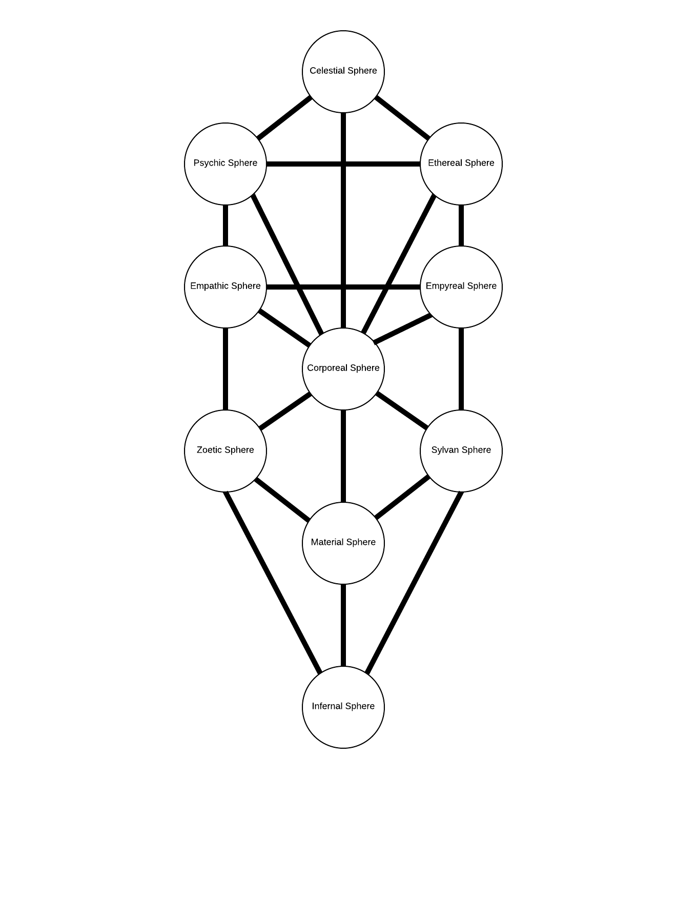

# Setting: The Magic of the Spheres

## The Higher Spheres
### Celestial Sphere
**Also Known As**: The Holy Sphere

**Domain**: Angels, God

### Psychic Sphere
**Also Known As**: The Mental Sphere

**Domain**: Human Mind

### Ethereal Sphere
**Also Known As**: The Spiritual Sphere

**Domain**: Spirits, the Dead

## The Limnal Spheres
The Limnal Sphere combines aspects of the Higher Spheres
and the Lower spheres. So while not strictly part of either,
these spheres counts as part of both for purposes of Detect.

### Empathic Sphere
**Domain**: Human Emotions

### Empyreal Sphere
**Also Known As**: The Ergic Sphere

**Domain**: Energy, Electricity

### Corporeal Sphere
**Also Known As**: The Physical Sphere

**Domain**: The Human Body

The human body combines feeling, energy,
material, animal, psychic, and emotional aspects.

## The Baser Spheres

### Material Sphere
**Also Known As**: The Demiurgic Sphere

**Domain**: The Material world of the inanimate objects and dead organics such as metal, wood, bone, stone, leather

### Zoetic Sphere
**Also Known As**: The Animal Sphere

**Domain**: Both the Physical and Mental aspects of the Living Animal world

### Sylvan Sphere
**Also Known As**: The Plant Sphere

**Domain**: The Living Plant world

### Infernal Sphere
**Also Known As**: The Chthonic Sphere

**Domain**: Devils, Demons, Fire
